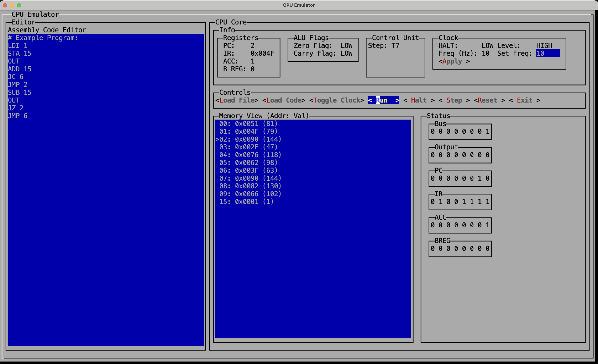

# CPU Simulator (80s Terminal Style)

A retro-style CPU simulator built with [Lanterna](https://github.com/mabe02/lanterna), a Java library for creating terminal-based UIs. This application simulates the internals of a classic 8-bit CPU, complete with registers, ALU, memory, flags, and clock. It features an assembly code editor and execution control (step, run, halt, reset), allowing users to write and test simple programs.

> 🎓 **Inspired by [Ben Eater's 8-bit breadboard computer](https://eater.net/8bit)**  
> This simulator is designed to emulate the same architecture and behavior, and can run **all the assembly programs** featured in his [YouTube series](https://www.youtube.com/playlist?list=PLowKtXNTBypGqImE405J2565dvjafglHU).

---

## ✨ Features

- Text-based UI with classic 80s terminal feel using Lanterna
- Full simulation of a Ben Eater-style 8-bit CPU:
  - Program Counter (PC)
  - Instruction Register (IR)
  - Accumulator (ACC) and B Register
  - Flags Register (Zero & Carry)
  - ALU with arithmetic operations
  - Output Register and Bus
  - Clock with adjustable frequency and HALT signal
  - RAM and dual ROM for microcode
- Live memory view and binary register display
- Assembly editor with code loading, stepping, and full execution
- File browser to load `.asm` or `.txt` assembly files
- Cross-platform: macOS, Linux, Windows, and WSL2
- Exit button and modal support (ESC key to close)

---

## 📦 Requirements

- Java 17+ (OpenJDK recommended)
- Gradle 8.5+ (via wrapper, no installation needed)

---

## 🚀 Getting Started

### 1. Clone or Download

```bash
git clone https://github.com/your-username/cpu-simulator.git
cd cpu-simulator
```

### 2. Run with Gradle Wrapper

```bash
chmod +x gradlew
./gradlew run
```

💡 Or build:

```bash
./gradlew build
```

---

## 🧠 Project Structure

```text
cpu-simulator/
├── build.gradle               # Gradle build file
├── gradlew / gradlew.bat     # Gradle wrapper scripts
├── gradle/wrapper/           # Gradle wrapper config and JAR
├── settings.gradle           # Root project settings
└── src/main/java/
    └── com/auctorlabs/cpusimulator/
        └── CpuSimulatorUI.java   # Main UI entry point
```

---

## 🛠 How It Works

This project simulates a microcoded 8-bit CPU by emulating each component in software and rendering its state in a text-based interface. It uses `Lanterna`’s `MultiWindowTextGUI` to display:

- **Registers** and binary values
- **Memory contents** and current PC location
- **Execution status and ALU flags**
- A live-updating **assembly editor** for program input

The control unit fetches, decodes, and executes instructions in cycles. Clock frequency can be controlled in real time.

---

## 🧪 Compatible Assembly Programs

You can run any program written for Ben Eater’s 8-bit CPU architecture. Examples include:

- Count-up and count-down loops
- Conditional jumps using JC and JZ
- Output patterns
- Fibonacci generators

Explore his full assembly programs in the [YouTube series](https://www.youtube.com/playlist?list=PLowKtXNTBypGqImE405J2565dvjafglHU) and [official page](https://eater.net/8bit).

---

## 📸 Screenshot



## 🎥 Demo


## 🧱 Built With

- Java 17+
- [Lanterna 3.1.1](https://github.com/mabe02/lanterna)
- Gradle 8.5 (via wrapper)

---

## 🧩 Future Ideas

- Syntax highlighting in assembly editor
- Breakpoint support
- Cycle-by-cycle instruction breakdown
- Export and import memory dumps

---

## 📝 License

This project is open source and available under the [MIT License](LICENSE).

---

## 🤝 Contributions

Pull requests and issues are welcome! Help expand the simulation or improve the UI.

---

## 👨‍🔧 Maintained by AuctorLabs

For updates, releases, and more projects, visit [AuctorLabs](https://auctorlabs.com/).  
Follow us for more educational simulators and retro computing content!